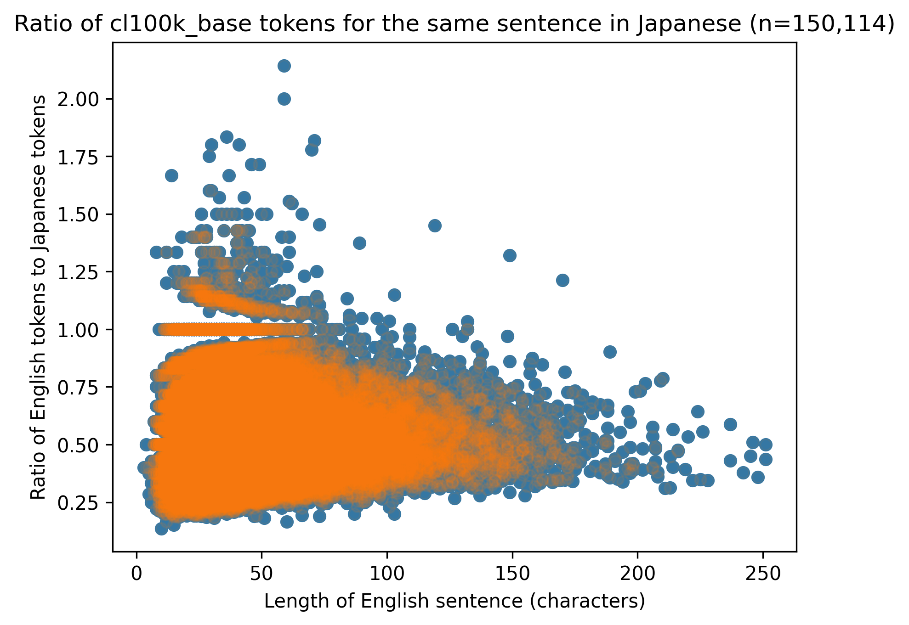

# Azure OpenAI Japanese Best Practices

## Goals

- [Understand the OpenAI cl100k_base BPE and how it tokenizes Japanese](tokens.ipynb)
- [Understand the expected/average number of tokens per word](sentences.ipynb)
- [Understand the ratio of tokens for Japanese and English for the same sentence](sentences.ipynb)
- Understand the performance of a tool to chunk text before a text embedding/vector index (ja.microsoft and ja.lucene performance)

## Findings

- All hiragana, katakana and half-width katakana are 1 or 2 tokens depending on their frequency in written text.
- In English common words tokens like and, of, and with include the preceeding space. Japanese does not use spaces to denote separation of words. However all particles (wa, ni, de, no, na, etc. ) are 1 token.
- Katakana loan words do not compress well (high tokens/word). 
- Some common kanji (647) are 1 token, the majority are 2 tokens and some are 3.
- The average number of tokens per word is hard to calculate because it depends on whether it is Hiragana, Katakana or Kanji (or a combination). 
- The ratio of tokens for Japanese from the same sentence in English is on average 1:2 but can be between 2-5x. This is based on a sample of 150,000 sentences translated between English and Japanese. Even though Japanese would have fewer characters, the tokens for the same sentence is almost always more than English.

## License

The notebooks are MIT license.

The data is public domain CC, see https://tatoeba.org/en/downloads
